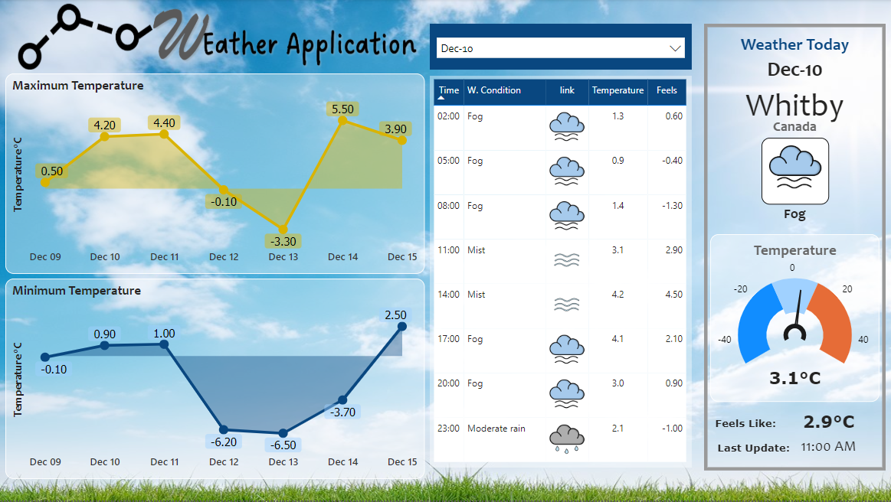

# Weather Application in Power BI

This is a weather application built using Power BI that visualizes weather data retrieved from the **Weather Unlocked API**. The application processes CSV files downloaded from the API and provides insights into weather conditions over a 5-day forecast period.

## Features:
- Displays the **minimum** and **maximum temperatures** for the last day, current day and the next 5 days.
- Shows a **table of weather conditions** for each day, including temperature, humidity, and condition descriptions.
- Visualizes the **current weather conditions** along with temperature, and a brief description.

## Data Source:
The data is sourced from the **Weather Unlocked API**, which provides weather information in JSON files, these were transform in CSV format. The CSV files must be imported into the Power BI application.

## How to Use:
1. **Download the files** from the [Weather Unlocked API](https://developer.weatherunlocked.com/).
    - Data Example: [Here](https://github.com/Eddisonandres/Power-BI-Projects/tree/main/data)
2. **Import the CSV files** into Power BI.
3. The report will automatically process the data and display the weather information for the last day and the next 5 days.
4. The visualizations include the temperature range, current weather conditions, and a detailed daily forecast.

## Screenshot:

## Requirements:
- Power BI Desktop
- CSV files from the data downloaded from Weather Unlocked API
